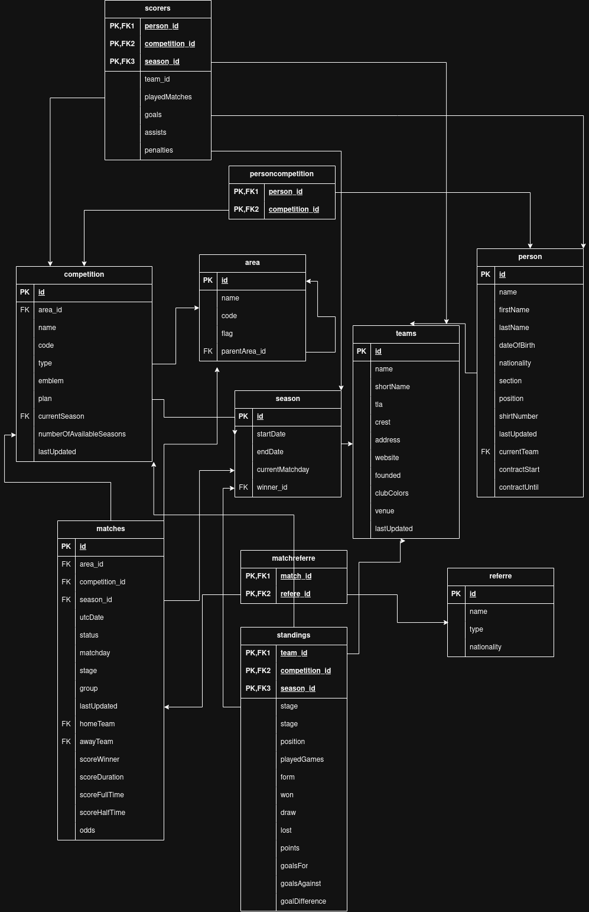
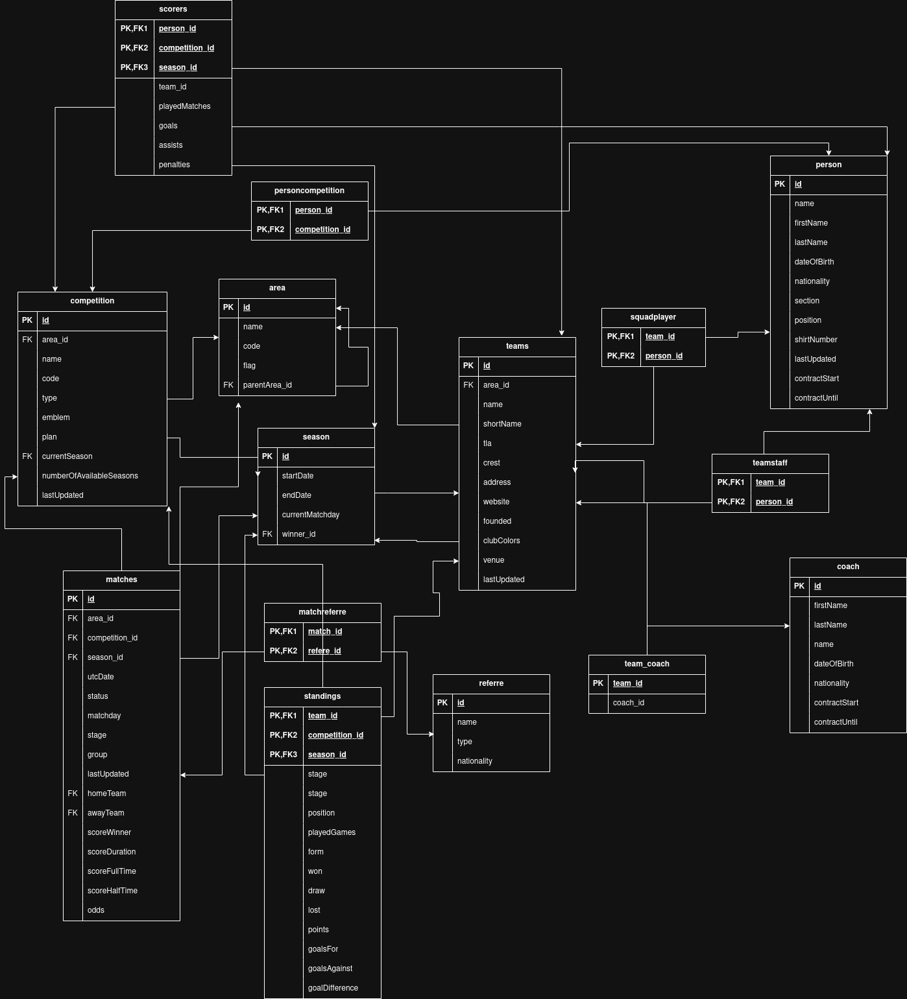

# Development Log

## Session 1 — Project Setup & Schema Design

**Objectives:**
- Set up the development environment
- Explore the API
- Design the database schema

**Work done:**

### Environment Setup
Installed and configured all required tools: PostgreSQL 16, Python 3.11 via deadsnakes 
PPA, pgAdmin 4, and VS Code with the Thunder Client extension. Created the project 
structure and virtual environment, and installed all Python dependencies.

### API Exploration
First contact with a REST API. Used Thunder Client to manually call each endpoint from 
football-data.org and analyse the raw JSON responses — areas, competitions, seasons, 
teams, matches, persons, standings and scorers — before writing any code.

### Database Schema Design
Designed the full relational schema from scratch in draw.io by analysing each API 
response field by field. Key decisions made during this process:
- Identified arrays in the API responses as many-to-many relationships requiring 
junction tables (`matchreferee`, `personcompetition`)
- Chose to flatten the `score` object directly into the `match` table (denormalisation) 
since it is always 1-to-1
- Designed composite primary keys for `scorers` (`person_id`, `competition_id`, 
`season_id`) and `standings` (`team_id`, `competition_id`, `season_id`)
- Used a self-referencing foreign key in `area` for the parent area relationship
- Renamed `group` to `match_group` — reserved keyword in SQL

**Schema at end of session 1 — 11 tables:**

`area` · `team` · `person` · `season` · `referee` · `competition` · `scorers` · 
`match` · `standings` · `matchreferee` · `personcompetition`



---

## Session 2 — Physical Implementation & Environment Setup

**Objectives:**
- Create the physical database
- Set up the `.env` file
- Clean up the repository

**Work done:**

### Physical Implementation
Executed the SQL schema in PostgreSQL via pgAdmin. While cross-referencing the API 
responses more carefully during implementation, found inconsistencies in the logical 
model that required corrections — 4 new tables were added to the schema.

### Schema Corrections
After revisiting the API responses in detail, the following tables were added:
- `squadplayer` — junction table between `team` and `person` for squad players
- `teamstaff` — junction table between `team` and `person` for staff members
- `coach` — separate entity for coach data (different structure from person in the API)
- `team_coach` — junction table between `team` and `coach`

### Environment Setup
Created the `.env` file with database credentials and API key. Understood its role in 
keeping sensitive data out of version control via `.gitignore`.

### Repository Cleanup
Removed an accidental `.Rhistory` file that had been committed in session 1.

**Schema at end of session 2 — 15 tables:**

`area` · `team` · `person` · `squadplayer` · `teamstaff` · `coach` · `team_coach` · 
`season` · `referee` · `competition` · `personcompetition` · `scorers` · `match` · 
`standings` · `matchreferee`



---

**Next session:** Connect the API to the database via Python — `settings.py` → 
`connection.py` → `extract.py`.

---

## Session 3 — Extraction, Transformation & Error Handling

**Objectives:**

* Continue implementing the extraction process
* Start the transformation phase
* Add error handling and respect API rate limits

**Work done:**

### Extraction

Continued working on the extraction phase by analysing the API structure in more detail and implementing the required data retrieval logic. Based on the previous API analysis, selected the necessary entities and identified which information could be obtained directly from the endpoints and which could be derived through relationships with other entities.

### Transformation

Started the transformation phase, preparing the extracted data for database insertion. Special attention was given to data types, particularly `TEXT` fields, to ensure compatibility with the database schema. To improve reliability, a helper function was created to safely handle `null` values and prevent transformation errors caused by missing data.

### Error Handling and API Constraints

While reviewing the extraction process, it became clear that additional error handling was required due to the possibility of API request failures. After consulting the API documentation, an important constraint was identified: the API allows a maximum of 6 requests per second. To accommodate this limitation, the extraction logic was reviewed and tested with rate-limiting considerations in mind, ensuring that requests remained within the allowed threshold and reducing the risk of failed executions.

**Next session:** Begin implementing the load phase and integrate the transformed data into the PostgreSQL database.

## Session 4 — Load Phase, Pipeline Integration & Bug Fixes

**Objectives:**
- Implement the load phase
- Build and run the full ETL pipeline
- Fix data integrity and schema issues

**Work done:**

### Load Phase
Implemented all `load_*` functions in `load.py` using a shared `load_to_db` helper to avoid code repetition. Each function uses `ON CONFLICT DO UPDATE` to handle re-runs cleanly — if the same record arrives twice, it updates instead of failing.

### Pipeline Runner
Built `pipeline/runner.py` to orchestrate the full ETL flow. Established the correct insertion order to respect foreign key dependencies: areas → seasons → competitions → teams → persons → matches.

### Bug Fixes & Schema Corrections

**`InvalidDatetimeFormat` on contract dates**
The API returns contract dates in `YYYY-MM` format but PostgreSQL `DATE` expects `YYYY-MM-DD`. Fixed by adding a `fix_date()` helper in `transform.py` that appends `-01` to incomplete dates. Chosen over changing the column type to preserve date query capability.

**Foreign key ordering issues**
Several `ForeignKeyViolation` errors were caused by inserting child records before parents. Resolved by reordering the pipeline and adding `DEFERRABLE INITIALLY DEFERRED` to two self-referencing or circular constraints (`area_parentarea_id_fkey`, `competition_currentseason_fkey`).

**`season.winner_id` circular dependency**
Seasons reference the winning team, but teams are inserted after seasons. Solved by inserting seasons with `winner_id = NULL` first, then updating after all teams are loaded using a dedicated `transform_seasons_winner` and `load_seasons_winner`.

**`personcompetition` references unavailable competitions**
Players can participate in competitions not available on the free API plan. Since those competitions are never inserted, the FK would always fail for those records. Dropped the `competition_id` foreign key on `personcompetition` — the valid competition records are still inserted correctly.

### Performance Optimisation
Added a `get_person_last_updated()` function to check if a person already exists in the database and when they were last updated. The pipeline now skips API requests for players that are already up to date, significantly reducing execution time on subsequent runs.

### Execution Logging
Added persistent file logging to the pipeline runner. Each run creates a timestamped 
log file in `logs/` (e.g. `pipeline_20260609_011500.log`) capturing all events — 
successful inserts, skipped records, errors and retries. Logs are written to both 
the console and file simultaneously.

## Session 5 — Fault Tolerance, Schema Fix & Scheduling

**Objectives:**
- Improve pipeline resilience against network interruptions
- Fix schema constraint issues found in production logs
- Automate weekly pipeline execution

**Work done:**

### Network Fault Tolerance

While reviewing the overnight pipeline log, it became clear that the pipeline was not completing full runs — network interruptions were causing `fetch_persons()` to fail mid-execution, leaving a portion of players unprocessed. To address this, a `failed_persons` retry queue was implemented in `runner.py`.

During the main loop, any player whose `fetch_persons()` call returns no data is appended to `failed_persons` instead of being silently skipped. Once the full team and squad loop completes, the pipeline makes a second pass over every queued `person_id` and retries the fetch. If the retry also fails, the error is logged and the record is skipped — this ensures a single bad request cannot block `load_squadplayers()`, which depends on all persons being inserted first and is only called after both passes are finished.

```python
failed_persons = []

for team in teams_data['teams']:
    for player in team['squad']:
        db_last_updated = get_person_last_updated(player['id'])
        api_last_updated = player.get('lastUpdated')

        if db_last_updated is None:
            person_data = fetch_persons(player['id'])
            if person_data:
                load_persons(transform_persons(person_data))
                load_personcompetition(transform_personcompetition(person_data))
            else:
                failed_persons.append(player['id'])

        elif api_last_updated and str(db_last_updated) != api_last_updated:
            person_data = fetch_persons(player['id'])
            if person_data:
                load_persons(transform_persons(person_data))
                load_personcompetition(transform_personcompetition(person_data))
            else:
                failed_persons.append(player['id'])

        else:
            logger.info(f"Skipping person {player['id']} - already up to date")

# retry failed persons before squad relations are inserted
if failed_persons:
    logger.info(f"Retrying {len(failed_persons)} failed persons...")
    for person_id in failed_persons:
        person_data = fetch_persons(person_id)
        if person_data:
            load_persons(transform_persons(person_data))
            load_personcompetition(transform_personcompetition(person_data))
        else:
            logger.error(f"Person {person_id} failed again - skipping")

load_squadplayers(transform_squadplayers(teams_data))
```

### Schema Fix — `nationality` Column Overflow

A `value too long for type character varying` error was raised during load, caused by nationality strings in the API responses exceeding the original column width. The `nationality` column on the `person` table was widened to accommodate longer values:

```sql
ALTER TABLE person ALTER COLUMN nationality TYPE VARCHAR(100);
```

### Automated Scheduling

Configured a `cron` job to run the pipeline automatically on a weekly schedule, removing the need to trigger it manually. The pipeline now executes unattended and writes its timestamped log to `logs/` as usual, making it straightforward to review what happened after each scheduled run.

---

**Next session:** TBD.